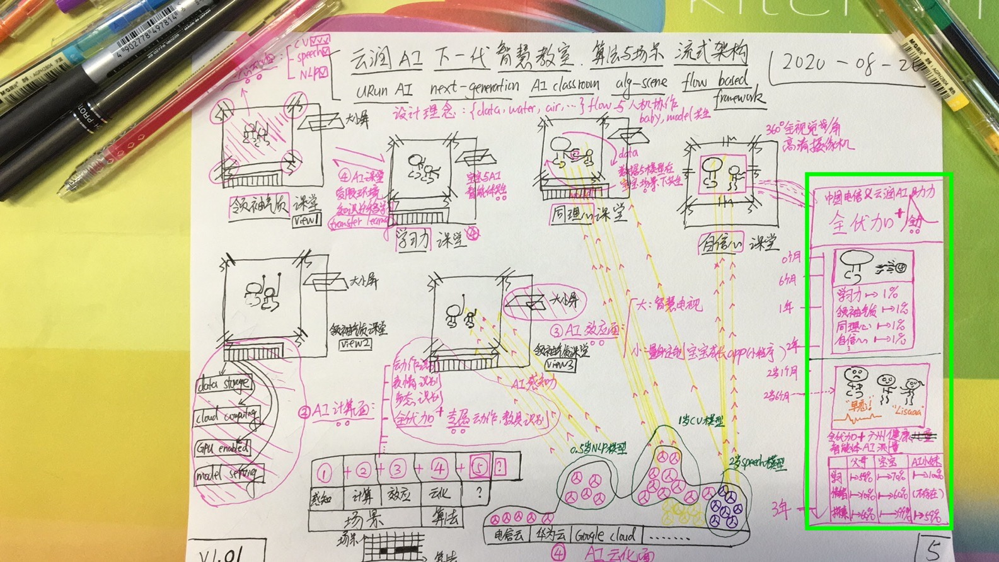

# 云润AI-下一代-智慧教育-算法与场景-流式架构
URun AI Next-Generation AI Classroom Alg-Scene flow based framework

## 设计理念
1. {data, water, air, ...}flow
2. 数据流与人机协作，万物皆智能体，智能体间均有沟通与联系
3. 化云为雨，滋润场景，乃公司名称“云润”
4. baby与model共生长

## 名词定义
### 智能体
1. 
### 智能体间的沟通与互动
1. 
### 算法
1. 如何为王？
### 场景
1. 如何落地？

## 案例分析
### 1. 广州全优加减乘除智慧教室解决方案及AI框架

* 整个解决方案以智能体为研究对象，AI解决方案可以分为：感知面，计算面，效应面，云化面，端化面及其他
* 婴幼儿智能体的成长以广州全优加减乘除X大发展能力作为主线作量化恒量，如自信心课堂，领导力课堂等

* 化云为雨
* 雨润场景